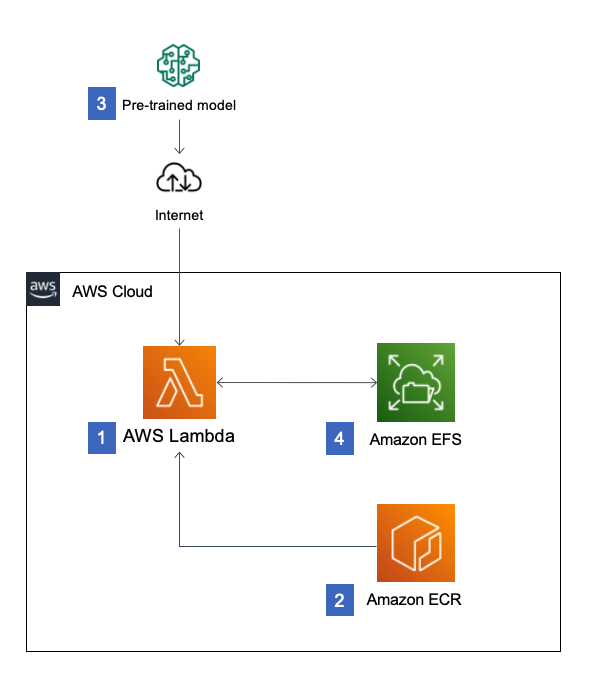

# AI-Models: HuggingFace Introduction 🤖

### Purpose of this workshop
* Basic introduction to common models
* Explore using https://huggingface.co
* Run different types of models to complete various tasks locally using Gradio UI
* Look at a way to run the models in AWS

## Project setup
1. `python -m venv .env`
2. `source .env/bin/activate`
3. `python -m pip install -r requirements.txt`

# Part 1 - Introduction to Hugging Face and how we can run some models locally

## What's huggingface? 🤗
[Hugging face](https://huggingface.co/) is a community and data science platform that provides:
* Tools that enable users to build, train and deploy ML models based on open source (OS) code and technologies.
* A place where a broad community of data scientists, researchers, and ML engineers can come together and share ideas, get support and contribute to open source projects.

### Some features
* Git-based hosted repository where you can store: Models, Datasets and spaces
* Models hub provides access to 300k+ models and the ability to upload your own
* Datasets - access to 50k+ 
* Spaces - 100k+ applications built by the community to explore
* Documentation on various topics, including tutorials and courses
* Hosted inference endpoints - a product to easily deploy models to production. Inference is run by Hugging Face in a dedicated, fully managed infrastructure on a cloud provider of your choice. (Production)
* Hosted inference API - test and evaluate, for free over 150k publicly accessible machine learning models or your own private models via HTTP requests, with fasst inference hosted on Hugging Face. (Free + Rate Limited

### Popular models
**BERT** (Bidirectional Encoder Representations from Transformers)
e.g. bert-case-uncased (NLP Tasks)
* Text classification - e.g. spam detection, sentiment analysis
* Answer Natural language questions
* Summarization
* Language translation
* Sentiment analysis
* Masks words for whenever noisy or missing words
* Detect emotions in sentences e.g. joy, sad 

**DistilBERT** (distilled version of BERT)
* Text classification - e.g. spam detection, sentiment analysis
* Answer Natural language questions
* Summarization
* Language translation
* Sentiment analysis
* Masks words for whenever noisy or missing words
* Detect emotions in sentences e.g. joy, sad 
* 60% faster than BERT
* 40% fewer parameters than BERT
* 40% lighter making it easier to deploy and use
* More efficient for training and use, better choice for resource-constrained environments

More here on BERT - https://huggingface.co/docs/transformers/model_doc/bert

**BART**
* multiple noisy transformations, improving the ability to generate grammatically correct sentences
* NLP tasks e.g. translation, summarization
* more here https://www.projectpro.io/article/transformers-bart-model-explained/553

More on BART here - https://huggingface.co/docs/transformers/model_doc/bart  
More on BART and comparisons with BERT and GPT-3** https://www.width.ai/post/bart-text-summarization

**stable-diffusion-v1-4**
* text to image diffusion model
* used to generate and modify images based on text prompts
* Latent diffused model uses pre-trained clip-ViT-L-14 which maps text and images to a shared vector space
* research uses only

Try a stable diffusion hosted inference api - https://huggingface.co/stabilityai/stable-diffusion-xl-base-1.0

### Some definitions
**Knowledge distillation** - process of transferring knowledge from a large model to a smaller one (smaller network) without loss of validity. 
Benefits are that smaller models are less expensive to evaluate and deployed on less powerful hardware.

**Model parameter count** - The number of parameters in an AI model is a measure of the model's complexity. The number relates to the number of variables (weights and biases) that can be adjusted during training to predict outcomes better. Higher is not always better, too high can produce over-fitting models.

**Over-fitting** - When the model is too complex cannot generalize accurately and fits too closely to the training data set that was used to train it causing higher error rates on test data.

**Under-fitting** - When the model wasn't trained enough, can be from too short of training duration or lacking training data.

## Practical 1 - running models locally
1. Get familiar with the [Hugging Face](https://huggingface.co/) website, searching models, data sets and workspaces
2. Run the model examples locally, see `sentiment.py`, `image.py`, `classification.py`
3. In `sentiment.py` update the function to test the other models and compare results
4. Go to `summarization.py` and create a working example of a text summarizer using a chosen model from [Hugging Face](https://huggingface.co/models?pipeline_tag=summarization&sort=trending).
5. (Optional) Try other summarization models e.g. `facebook/bart-large-xsum` or `google/pegasus-xsum` and compare results

## Practical 2 - running the models in AWS
[Clone the project](https://github.com/aws-samples/zero-administration-inference-with-aws-lambda-for-hugging-face) and complete the steps in the ReadMe

One approach we can try is to use container image-based Lambda function that performs Machine Learning inference using pre-trained Hugging Face models. The models will be cached and store in AWS EFS to reduce latency

This practical is taking from [Hosting Hugging Face models on AWS](https://aws.amazon.com/blogs/compute/hosting-hugging-face-models-on-aws-lambda/)

  
In this architectural diagram:
1.  Serverless inference is achieved by using Lambda functions that are
    based on container image
2.  The container image is stored in an [Amazon Elastic Container Registry](https://aws.amazon.com/ecr/) (ECR) repository within your
    account
3.  Pre-trained models are automatically downloaded from Hugging Face
    the first time the function is invoked
4.  Pre-trained models are cached within Amazon Elastic File System
    storage in order to improve inference latency

### Tasks
* Clone and deploy the project
* Test each of the lambda functions in the AWS console
* Add a new inference lambda to the project using an example taken from the local examples in this project .e.g classify.py
* Don't forget to clean up! `cdk destroy`

### End
Make yourself a barbie or ken 